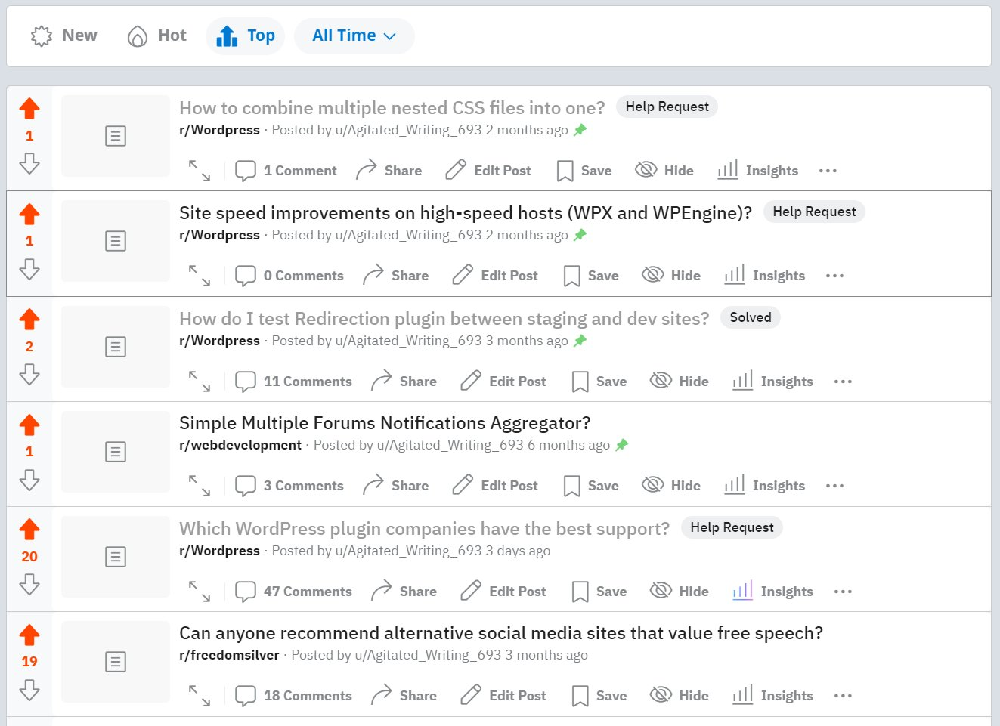
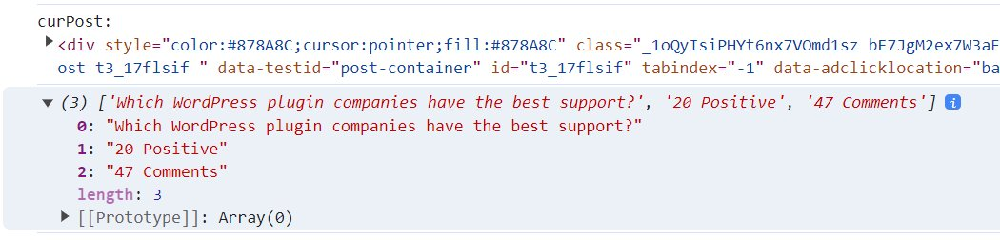

| INFO PROPERTY | VALUE                                       |
| ------------- | ------------------------------------------- |
| Program Name  | **: Scrape Reddit Post List** |
| Program Type  | Script                                      |
| File Name     | README.md                                   |
| Date Created  | 10/27/23                                    |
| Date Modified | --                                          |
| Version       | 0.0.1                                       |
| Programmer    | **Eric Hepperle**                           |

### TECHNOLOGIES

 

## Purpose

Scrapes data from Reddit post list and formats as CSV. Data points include title, subreddit, post url, etc.

_Reddit posts results list_

_Scraped results data in Chrome dev console_
    
## Usage

1. Login to Reddit in a browser and click your profile icon in upper right
2. Click "Profile", then click the "POSTS" tab
3. Cut-Paste the below code into the dev console and hit enter
    
## Sample Results: 

### Original
~~~
(3) ['Which WordPress plugin companies have the best support?', '20 Positive', '47 Comments']
0: "Which WordPress plugin companies have the best support?"
1: "20 Positive"
2: "47 Comments"
~~~

### printReportForConsole()

~~~
Post ID: t3_17flsif | Title: Which WordPress plugin companies have the best support?
Comment Count: 47 Comments
Votes: 21 Positive
~~~

### printMarkdownTable()

Note: The ` ` tag is what lets to contents of a column/cell span multiple lines. This looks much better on the backend in VSCode when you have a formatted in place. I do "CTRL+SHIFT+P" > "Format Document".

Also, I have formatted these tables in VSCCode; in dev console the print messier without straight columns.

~~~
| LEFT                | RIGHT                                                                                                                       |
| ------------------- | --------------------------------------------------------------------------------------------------------------------------- |
| Post ID: t3_15tt1xu | Title: How to combine multiple nested CSS files into one? Comment Count: 1 Comment Votes: 1 Positive                  |
| Post ID: t3_15s6g6h | Title: Site speed improvements on high-speed hosts (WPX and WPEngine)? Comment Count: 0 Comments Votes: 1 Positive    |
| Post ID: t3_1535yi7 | Title: How do I test Redirection plugin between staging and dev sites? Comment Count: 11 Comments Votes: 2 Positive   |
| Post ID: t3_136qoy5 | Title: Simple Multiple Forums Notifications Aggregator? Comment Count: 3 Comments Votes: 1 Positive                   |
| Post ID: t3_17h270p | Title: Best WordPress plugin for automatic backup to Google SHARED DRIVE Comment Count: 18 Comments Votes: 1 Positive |
| Post ID: t3_17g5fir | Title: Are there any plugins to BATCH scale images in Figma? Comment Count: 5 Comments Votes: 1 Positive              |
~~~

### printIdAndTitle()

~~~
| ID         | TITLE                                                                                               |
| ---------- | --------------------------------------------------------------------------------------------------- |
| t3_15tt1xu | How to combine multiple nested CSS files into one?                                                  |
| t3_15s6g6h | Site speed improvements on high-speed hosts (WPX and WPEngine)?                                     |
| t3_1535yi7 | How do I test Redirection plugin between staging and dev sites?                                     |
| t3_136qoy5 | Simple Multiple Forums Notifications Aggregator?                                                    |
~~~

## Requires
* Browser logged into Reddit account with developer console exposed.
    
## Demonstrates
* JavaScript
* ES6 / ECMAScript 2015
* Web Scraping / Web Scrapers
* Vanilla JavaScript
* Reddit Scraping

## TAGS
`JavaScript` `ES6` `Web Scraping` `Vanilla JavaScript` `Reddit`

## VOCAB
- N/A

## Resources
- N/A
